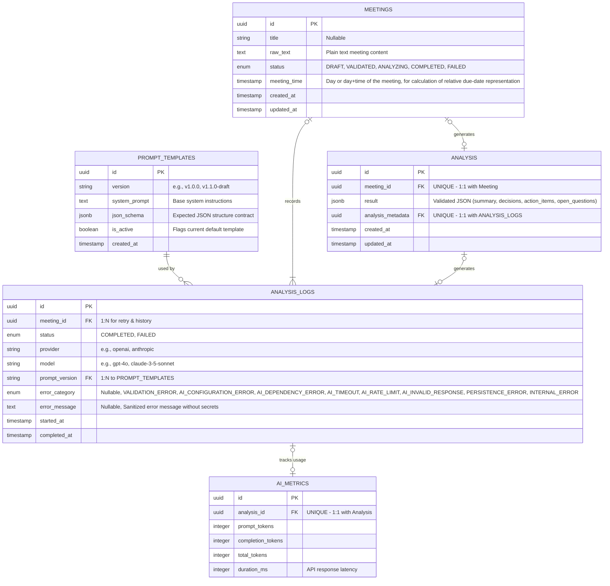
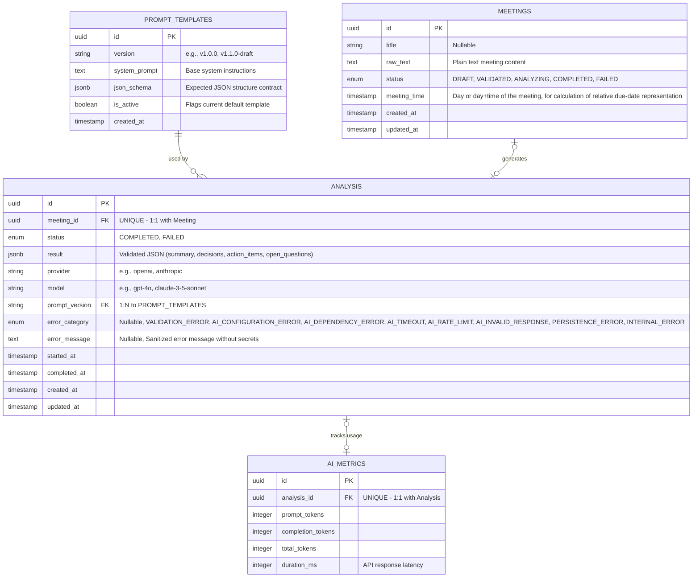

# ADR-001 — Database Arquitecture

## Status

Proposed

## Context

The application must persist meeting content and structured AI results while allowing the team to track relevant metadata or AI failure.

## Constraints

- AI output must be validated before persistence.
- AI provider/model, prompt version, errors, and usage metrics should be traceable.
- Secrets and sensitive provider information must not be persisted.
- The schema should remain small enough for the MVP.

## Options considered

### Option A

**Pros:**
- Preserves the complete analysis/retry history.
- Allows comparison between successful and failed attempts.
- Enables token and latency tracking per attempt.
- Makes AI failures easier to diagnose.
- Supports future provider/model comparisons without changing the core model.
- Better auditability and observability.

---

**Cons:**
- More tables and relationships.
- Slightly more complex queries and application logic.
- Requires defining which analysis is the current/latest result.

### Option B

**Pros:**
- Simpler schema and implementation.
- Easier queries because each meeting has a single analysis.
- Lower storage requirements.

---

**Cons:**
- Previous analysis attempts are lost.
- Limited visibility into retries and AI failures.
- Token usage and latency history is lost.
- Harder to diagnose provider/model changes.
- Less useful for evaluating AI behavior during the exercise.

## Decision

We will choose schema A, the application will preserve analysis attempts in `ANALYSIS_LOGS`, while `ANALYSIS` represents the validated result associated with the meeting. AI usage metrics will be stored separately in `AI_METRICS`.

This provides better observability and supports retries without significantly increasing the complexity of the MVP.

## Consequences

- The application must distinguish the current successful analysis from historical attempts.
- Every AI attempt should generate an `ANALYSIS_LOGS` record, regardless of its output.
- Token usage and latency should be recorded when provided by the AI provider.
- Failed attempts remain available for diagnosis but must not be treated as valid meeting results.
- Tests must cover successful analysis, retries, failures, and metric persistence.

## Compatibility / migration

No existing production data is affected. The initial PostgreSQL schema will introduce `PROMPT_TEMPLATES`, `MEETINGS`, `ANALYSIS`, `ANALYSIS_LOGS`, and `AI_METRICS`.

Future schema changes must be implemented through Laravel migrations and reflected in this ADR or a subsequent ADR when architecturally significant. An example of usefull schema could be USERS (to enforce privacy between users if its hosted) but account management is outside of the MVP.

## Date

15/08/2026

## Participants

Kaled Sánchez & Carlos Rebolledo

